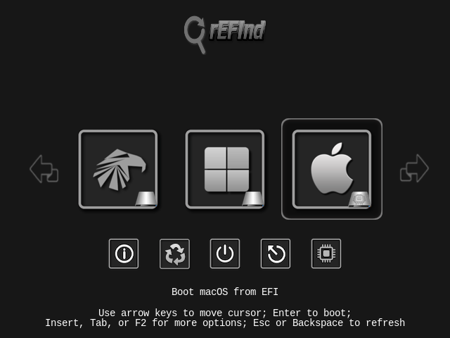
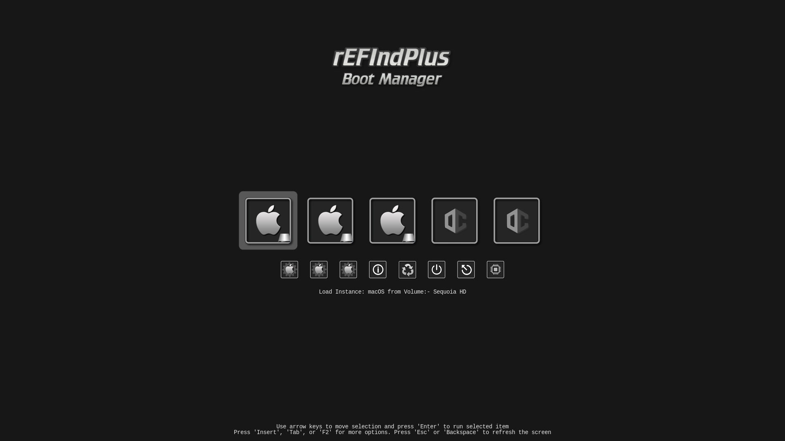

# Icon-Set-DarkGrey-Refind
- Icon Set use with [rEFInd](https://www.rodsbooks.com/refind/) and  [RefindPlus](https://github.com/dakanji/RefindPlus)
  
- ### 87 Distro Icons DarkGrey Square

View ➤ [Ison Set](https://github.com/chris1111/Icon-Set-DarkGrey-Refind/blob/main/View-Set.md)
View ➤ [All Icons](https://github.com/chris1111/Icon-Set-DarkGrey-Refind/tree/main/Icon-Set-DarkGrey)

Configuration ➤ [Refind config](https://github.com/chris1111/Icon-Set-DarkGrey-Refind/blob/main/refind-Icon-Set-DarkGrey-Refind.conf)

Download Icons Set ➤ [Icon-Set-DarkGrey.zip](https://github.com/chris1111/Icon-Set-DarkGrey-Refind/raw/refs/heads/main/Icon-Set-DarkGrey.zip)

### rEFInd

### rEFIndPlus

My Other theme ⬇︎

[Shadow-rEFInd](https://github.com/chris1111/Shadow-rEFInd)

[rEFInd-Shadow-IOS](https://github.com/chris1111/rEFInd-Shadow-IOS)

[rEFInd-Metal-Frame](https://github.com/chris1111/rEFInd-Metal-Frame)

Icon base on [distro icons](https://www.dropbox.com/s/uhl8sz1gwse2zd6/distro_icons.zip?dl=0)
