## View Set

 
 
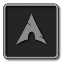 
 
 
 
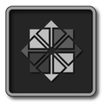 
 
 
 
 
 
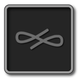 
 
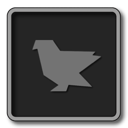 
 
 
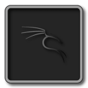 
 
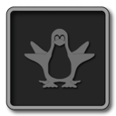 
 
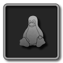 

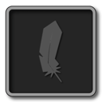 
 
 
 
 
 
 
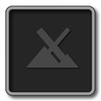 
 
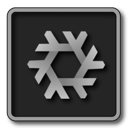 
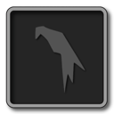 
 
 
 
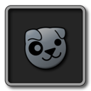 
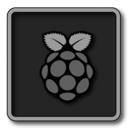 
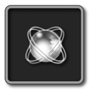 
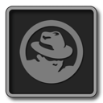 
 
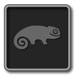 
 
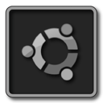 
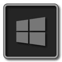 
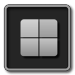 
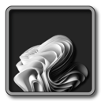 
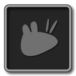 
 

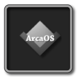
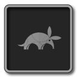
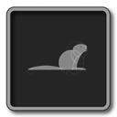
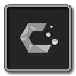

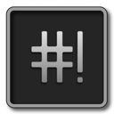

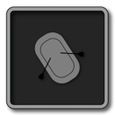
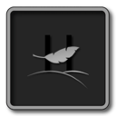
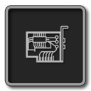
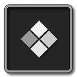
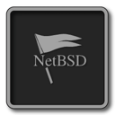

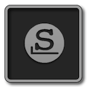
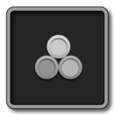

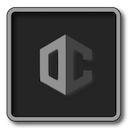

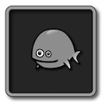

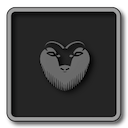
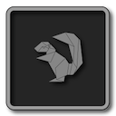
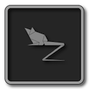
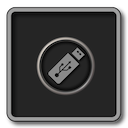




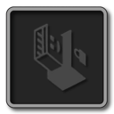

### Banner
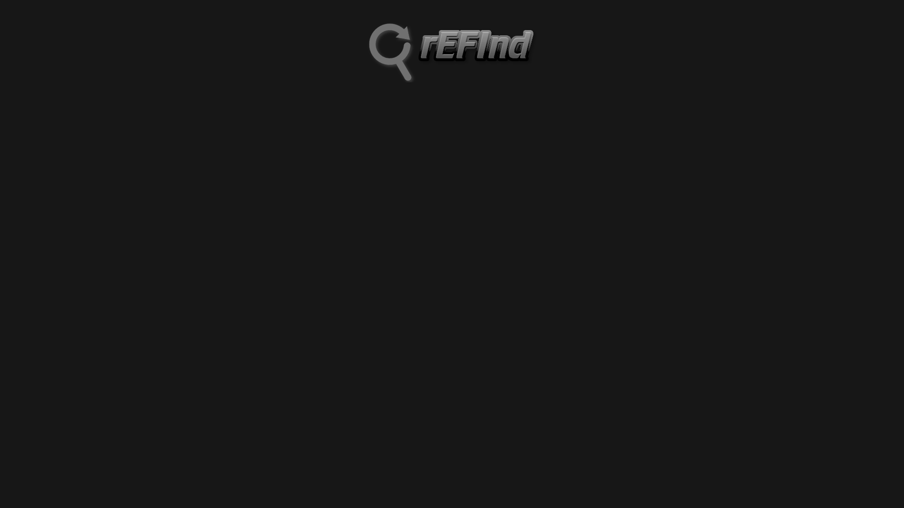
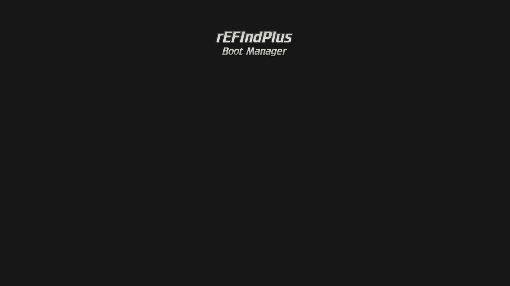

[Back On ➦ Top](https://github.com/chris1111/Icon-Set-DarkGrey-RefindPlus-GOPFix/blob/main/View-Set.md#view-set)
